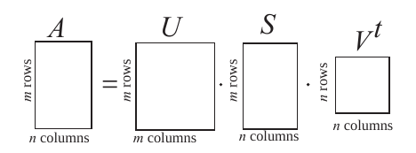

# Singular Value Decomposition
## Descrição e aplicação


* Esclarecimento sobre notação: na notação BT, o "T" significa que a dada matriz é a transposta.
Por exemplo, FT é a matriz transposta da matriz F.

### Dada (ou dado) uma matriz M, a decomposição SVD entrega, ao final de seu processo, três matrizes, U, Σ e VT, de forma que M = U * Σ * VT.
> Como é feita a decomposição da matriz M:  
    1. É computada uma matriz M\*MT e são calculados os autovetores dessa matriz. Tais autovetores formarão as colunas da matriz U.  
    2. De modo análogo, é computada uma matriz MT\*M e seus autovetores formam as linhas da matriz VT.  
    3. Finalmente, a matriz Σ é formada pelos autovalores de MT\*M.  

* Ilustrações das transformações que cada matriz produzida na fatoração:
    * Procedimento sumarizado:  
      
    * Animação com as transformações:  
    

#### Algoritmo para decomposição SVD em Python puro
```python
import numpy as np

matrix = np.array([[3, 5, 7],
                   [9, 11, 13],
                   [15, 17, 19]])

MMT = matrix @ np.transpose(matrix)
MTM = np.transpose(matrix) @ matrix

mmt_eigvalues, mmt_eigvectors = np.linalg.eig(MMT)
mtm_eigvalues, mtm_eigvectors = np.linalg.eig(MTM)

mmt_eigvalues = np.sqrt(mmt_eigvalues)
mtm_eigvalues = np.sqrt(mtm_eigvalues)

sigma = np.zeros((matrix.shape[0], matrix.shape[1]))
sigma[:matrix.shape[1], :matrix.shape[1]] = np.diag(mtm_eigvalues)

U = mmt_eigvectors
S = sigma
VT = np.transpose(mtm_eigvectors)
```  


#### Cálculo do SVD através do numpy

reformatar esse informações
* INFORMAÇÕES: um valor singular referente a um autovetor é a raiz quadrada do autovalor pertencente a esse mesmo autovetor

* Em uma matriz A, m x n, não-quadrada, a decomposição resulta nas seguintes três matrizes:
    1. U, matriz quadrada, m x m
    2. S (ou Sigma), matriz diagonal, m x n
    3. VT, matriz quadrada, n x n  



* S, que tem a mesma forma de A, é uma matriz diagonal com os valores singulares de A contidos em sua diagonal principal. 
Portanto, fica evidente que S terá *n* valores singulares e *m-n* linhas de zeros após o último valor singular (ou seja, a partir da linha n+1). 
Assim, as últimas *m-n* colunas de U não afetam o cálculo do produto _U * S_. Dessa forma, existem duas maneiras de calcular a decomposição: 
uma que utiliza as matrizes inteiras e outra que otimiza o cálculo, tirando cômputos desnecessários.

* Na imagem abaixo, o cálculo é otimizado a fim de aproveitar-se somente das primeiras *p* linhas de _S_ e *p* colunas de _U_:  

    

#### Cálculos empregando funções do numpy

##### Matriz cheia

```python
import numpy as np


matrix = np.array([[1, 2], [3, 4],
                   [5, 6], [7, 8],
                   [9, 10], [11, 12]])

U, S, VT = np.linalg.svd(matrix)
```  

* Para o método otimizado, o código é quase idêntico, muda-se apenas o parâmetro "full_matrices", que agora recebe "False" como valor.

```python
import numpy as np


matrix = np.array( [[1, 2], 
                    [3, 4],
                    [5, 6], 
                    [7, 8],
                    [9, 10], 
                    [11, 12]])

U, S, VT = np.linalg.svd(matrix, full_matrices=False)
```  

* Em ambos os casos, o resultado é o mesmo:

```python 
U:
 [[-0.08476661 -0.71876571]
 [-0.19556039 -0.50694598]
 [-0.30635416 -0.29512626]
 [-0.41714794 -0.08330653]
 [-0.52794171  0.1285132 ]
 [-0.63873549  0.34033292]]

VT transposed: 
 [[-0.66323476  0.74841142]
 [-0.74841142 -0.66323476]]

Sigma: 
 [[25.48240967  0.        ]
 [ 0.          0.80423719]
 [ 0.          0.        ]
 [ 0.          0.        ]
 [ 0.          0.        ]
 [ 0.          0.        ]]

Original matrix: 
 [[ 1.  2.]
 [ 3.  4.]
 [ 5.  6.]
 [ 7.  8.]
 [ 9. 10.]
 [11. 12.]]
```  

#### Cálculo do SVD utilizando a biblioteca sklearn

A função *sklearn.decomposition.TruncatedSVD(n_components=desired_precision)* retorna um estimador que deve ser treinado e, assim, poderá ser manipulado para reduzir a dimensão dos dados de uma matriz qualquer
 (ou seja, aplicar SVD na matriz, retornando as matrizes com tamanho em função de "n_components").  
A biblioteca sklearn tem desempenho notavelmente mais rápido que as funções da biblioteca numpy (esta que deve ser operada somente por utilidade, em demonstrações simples de procedimentos).  
Todavia, ambas aproveitam-se de implementações dos procedimentos em FORTRAN, onde um dos métodos do sklearn serve-se de algoritmos pseudoaleatórios.  

### PARA CUSTO COMPUTACIONAL: APLICAR EM DIVERSAS MATRIZES DE ORDEM CRESCENTE COM ENTRADAS REAIS ALEATÓRIAS

### Custo computacional
* No algoritmo para a decomposição SVD de uma matriz A, o custo computacional está em:
    1. Armazenar A, AT, U, Σ e VT em memória;
    2. Calcular dois produtos de matrizes, M\*MT e MT\*M;
        * O produto entre as matrizes, em uma de suas melhores implementações, lançará mão do algoritmo de Strassen, que otimiza 
        velocidade em troca de espaço na memória. Uma multiplicação comum entre matrizes leva Θ(n³) operações para ser realizada, 
        enquanto Strassen exige, no pior caso, O(n^2.80).  
    3. Finalmente, e, principalmente, em encontrar dois conjuntos de autovetores e um conjunto de autovalores.  
        * Para este processo, recomenda-se o algoritmo QR com reflexões de Householder, que exige O(9n³) operações. 
        Para efeito de comparações, a versão sem as reflexões demanda O(n⁴) operações.  
        
### Exemplo de aplicação do SVD: compressão de imagens  

##### Código para comprimir imagem, visualizar os diversos resultados e exibir a magnitude dos valores singulares em ordem decrescente

```python
from matplotlib.image import imread
import matplotlib.pyplot as plt
import numpy as np
import os

plt.rcParams['figure.figsize'] = [16, 9]

image = imread(
    os.path.join(
        '/kaggle/input/peaky-blinder.jpg'))

normalized_image = image[:, :, :]

normalized_image = (normalized_image - normalized_image.min()) / (normalized_image.max() - normalized_image.min())

# AQUIIIIIIIIIIIIIIIIIIIIIIIIIIIIIIIIIIIIIIIIIIIIIIIIIIIIIIIIIIIIIIII
# Explicar a necessidade da normalizacao: https://en.wikipedia.org/wiki/Normalization_(image_processing)

img = plt.imshow(normalized_image)
plt.axis('off')
plt.show()

red_component = normalized_image[:, :, 0]
green_component = normalized_image[:, :, 1]
blue_component = normalized_image[:, :, 2]

U0, S0, VT0 = np.linalg.svd(red_component, full_matrices=False)
U1, S1, VT1 = np.linalg.svd(green_component, full_matrices=False)
U2, S2, VT2 = np.linalg.svd(blue_component, full_matrices=False)

S0 = np.diag(S0)
S1 = np.diag(S1)
S2 = np.diag(S2)

for precision in range(5, 200, 20):
    # Construct approximate image, one time for each color (RGB)
    red_approximation = U0[:, :precision] @ S0[0:precision, :precision] @ VT0[:precision, :]
    green_approximation = U1[:, :precision] @ S1[0:precision, :precision] @ VT1[:precision, :]
    blue_approximation = U2[:, :precision] @ S2[0:precision, :precision] @ VT2[:precision, :]

    image_approximation = np.zeros((normalized_image.shape[0], normalized_image.shape[1], normalized_image.shape[2]))
    image_approximation[:, :, 0] = red_approximation
    image_approximation[:, :, 1] = green_approximation
    image_approximation[:, :, 2] = blue_approximation

    plt.imshow(image_approximation)
    plt.axis('off')
        
    plt.title("precision = {} eigenimages - Compression ratio: {:.2f}%".format(precision, ((1 - precision/image.shape[0]) * 100)))
    plt.savefig("precision_" + str(precision))
    plt.show()

plt.title('Original image - precision = ' + str(image.shape[0]) + " eigenimages - Compression ratio: 0%")
plt.axis('off')
plt.imshow(image)
plt.tight_layout()
plt.show()

S = S2
# AQUIIIIIIIIIIIIIIIIIIIIIIIIIIIIIIIIIIIIIIIIIIIIIIIIIIIIIIIIIIIIIIII
# Explicar o S2

print(np.diag(S)[0] / np.diag(S)[len(S) - 1])
# AQUIIIIIIIIIIIIIIIIIIIIIIIIIIIIIIIIIIIIIIIIIIIIIIIIIIIIIIIIIIIIIIII
# Comentar esse quociente

plt.figure(1)
plt.semilogy(np.diag(S))
plt.title('Singular values\' magnitudes')
plt.ylabel("magnitude")
plt.xlabel("singular value's position")
plt.show()

plt.figure(2)
plt.plot(np.cumsum(np.diag(S)) / np.sum(np.diag(S)))
plt.title('Singular values: cumulative sum')
plt.ylabel("magnitude percentage")
plt.xlabel("singular value's position")
plt.show()
```

##### Processo de compressão da imagem, variando a precisão baseada nos vetores singulares (explicar melhor)  


